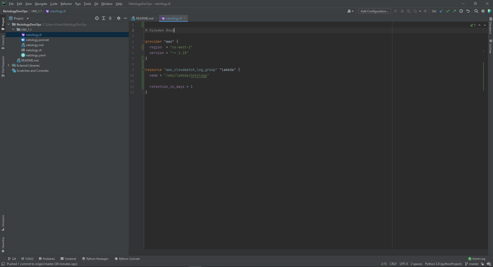
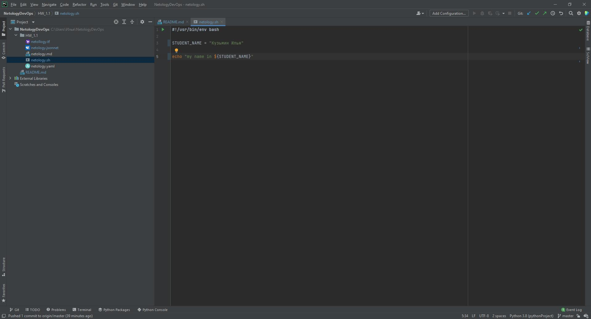
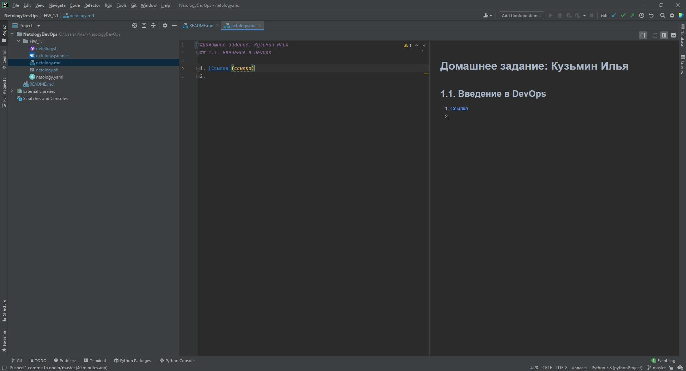
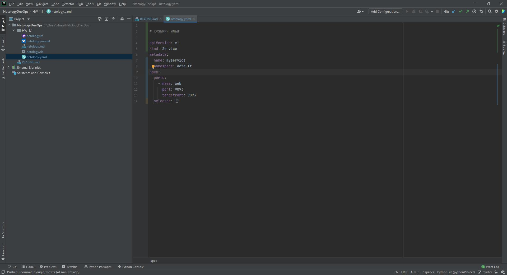
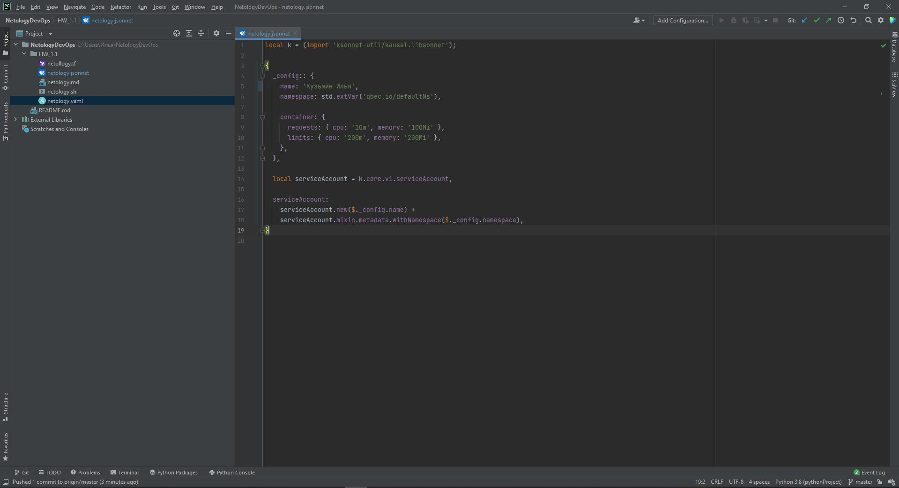

# Решения домашних заданий по курсу DevOps (Поток 2): Кузьмин Илья.

## 1.1. Введение в DevOps
### Задание 1.
Ссылки на скриншоты экрана:
1. **Terraform**

2. **Bash**

5. **Markdown**
 
7. **Yaml**

9. **Jsonnet**

### Задание 2
Разработка ведется в рамках спринтов. Результатом спринта является релиз, который включает в себя решения ряда согласованных с заказчиком
задач: новых фич, изменения функционала или исправление различного рода ошибок. 
После передачи релиза и установки его на прод имеется возможность откатиться к предыдущему релизу.

Для формирования и передачи решения к релизу N нужны следующие шаги:
1. Формирование списка задач и оценка трудозатрат (этап коммуникации)
   1. Менеджеры проекта и аналитики совместно с заказчиком устанавливают необходимый набор задач. 
   2. Аналитики собирают требования и формируют постановки.
   3. Архитектор/Тимлид продумывает общие вопросы структуры/архитектуры решения и распределяет работы
   по разработчикам.
   4. Разработчики по заданным постановкам оценивают трудоемкости задач.
   5. DevOps определяет необходимый набор работ и инструментов совместно с тимлидом, разработчиками, менеджерами и аналитиками.
   6. Возврат к п. 1 для уточнения списка задач при возникновении вопросов или превышении заданной к релизу трудоемкости.
2. Реализация задач (этапы подготовки инфраструктуры, разработки, интеграций и тестирования)
   1. DevOps настраивает репозиторий и CI/CD (если это не настроено), раздает права, подготовливает инфраструктуру как для разработки/интеграций и тестирования, 
   так и для демонстрации нового функционала, возможно закупает лицензии необходимых доп. инструментов и библиотек.
   2. Разработчики пишут код по заданным постановкам а команда QA реализует автотесты.
   3. Решив задачу разработчик запрашивает у другого разработчика или тимлида код ревью. При успешном прохождении код ревью кидает мержреквест на DevOps. 
   Либо другой разработчик или тимлид возвращают задачу на доработку.
   4. DevOps разворачивает ветку разработчика на изолированном тестовом контуре, проверяет автотесты и убеждается в их прохождении. 
   При необходимости далее запрашивает у QA ручное тестирование. При не прохождении автотестов из за ошибки в коде, 
   наличии ошибки в самих тестах или не прохождении ручного тестирования мержреквест отклоняется, а задача или тест возвращается на доработку.
   5. DevOps при успешном прохождении всех тестов принимает мержреквест и ветка разрабочика вливается в общую ветку релиза 
   и автоматически разворачивается на демо-стенде/общем тестовом контуре.
   6. После решения задач разработчиками QA производят регрессионное тестирование по заданной программе и методике испытаний, 
   для проверки всего функционала решения.
   7. Если все тесты пройдены, то при необходимости решение можно продемонстрировать заказчику на демо-стенде, в противном случае
   часть решения возвращается на доработку разработчикам, а ошибочные коммиты по возможности откатываются. 
   Также демонстрация заказчику возможна и для отдельных фич по их готовности.
3. Внедрение и поддержка (Разворачивание релиза на продуктиве и его поддержка)
   1. DevOps готовит решение к установке на прод - вносит доп. настройки (например оповещения для случаев ошибок и логи), 
   реализует возможность отката к текущему состоянию.
   2. После подготовки решение атоматически разворачивается на проде. При возникновении критических ошибок или падении сервера
   откатывает решение к предыдущему состоянию (также автоматически - предварительно настроив). 
   3. После отката при возникновении ошибок DevOps собирает логи сервера, логи приложения, логи базы данных и анализирует.
   4. Результаты анализа логов DevOps передает тимлиду/архитектору и аналитикам, а также объясняет в чем проблема менеджерам.
   5. Разработчики, аналитики и DevOps совместно разрабатывают план решения проблемы, менеджеры доносят суть проблемы и сроки устранения до заказчика.
   6. Ошбики распределяются по разработчикам и возврат к п. 2.ii, только в этом случае готовится патч к релизу.
   7. При успешной установке решения на прод переход к п. 1.i для релиза N + 1.

   

