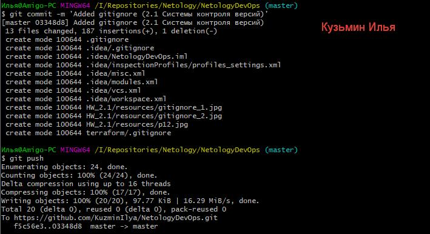
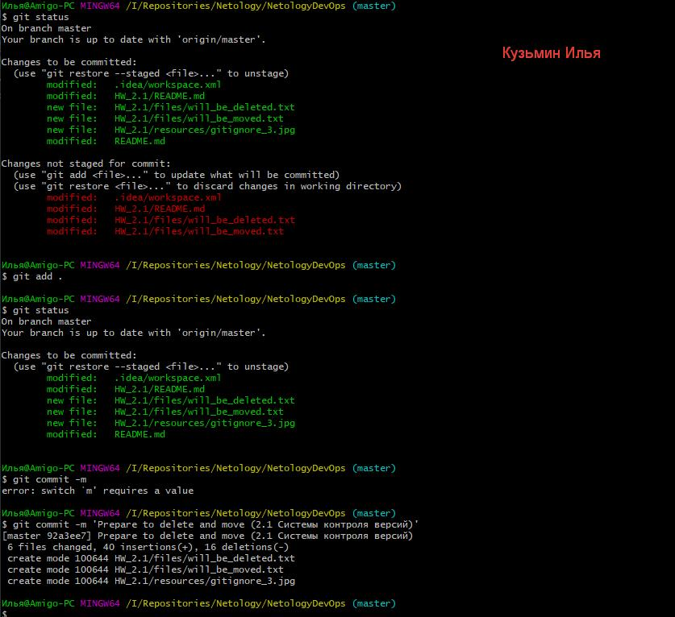
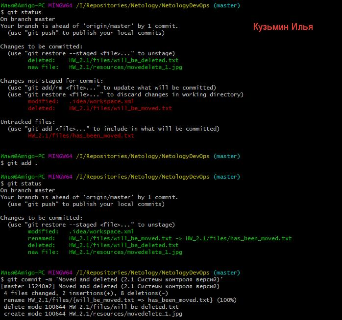
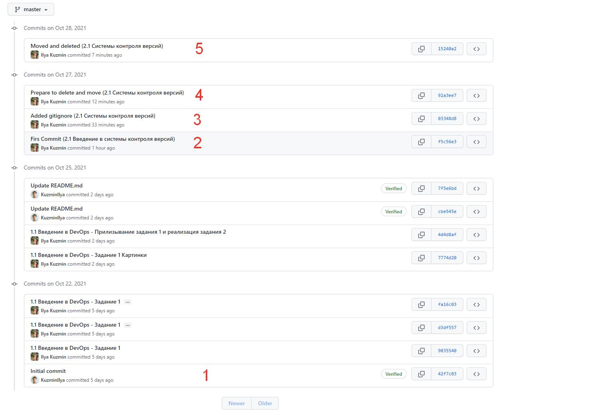
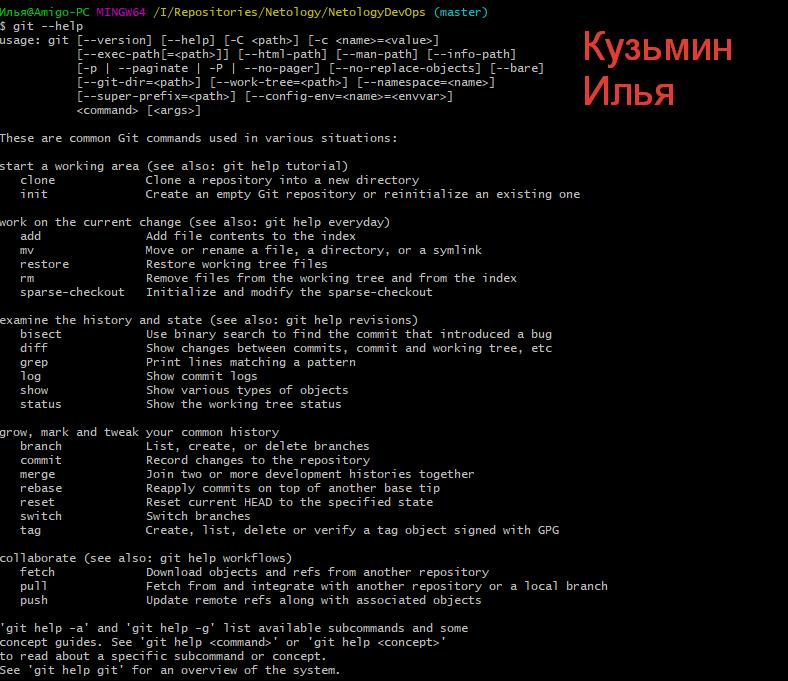

#2.1. Системы контроля версий, Кузьмин Илья (поток 2)

##Задание 1

###**1. Настройка репозитория (первый коммит)**

**п. 1 - 5** 

**п. 6 - 8**

**п. 9**

**п. 10**

**п. 12**

###**2. gitignore (второй коммит)**

**п. 1**

**п. 2**

**п. 4**

Описание игнорируемых файлов в данном каталоге:
 * \*\*/.terraform/\* - игнорируются все файлы в директории .terraform не включая подкаталоги, 
Сама .terraform может находиться по любому пути, начиная с /terraform, т.к. gitignore находится в ней.
 * *.tfstate - все файлы с расширением .tfstate
 * \*.tfstate.\* - все файлы, содержащие подстроку .tfstate. в имени
 * crash.log - файл с указанным именем
 * *.tfvars - все файлы с расширением .tfvars
 * override.tf - файл с данным именем
 * override.tf.json - файл с данным именем
 * *_override.tf - все файлы, которые оканчиваются на _override.tf
 * *_override.tf.json - все файлы, которые оканчиваются на _override.tf.json
 * .terraformrc - файл с данным именем
 * terraform.rc - файл с данным именем

**п. 5**

### **3. Удаление и перемещение файлов (третий и четвертый коммиты)**

**п. 1,2**

**п. 3 - 5**

### **4. Проверка изменений**

##Задание 2

**Вывод git --help**

  