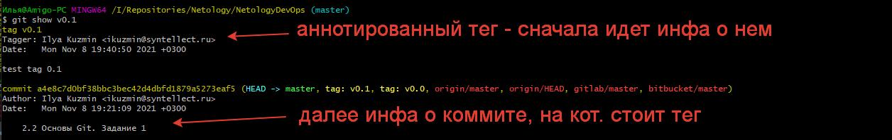
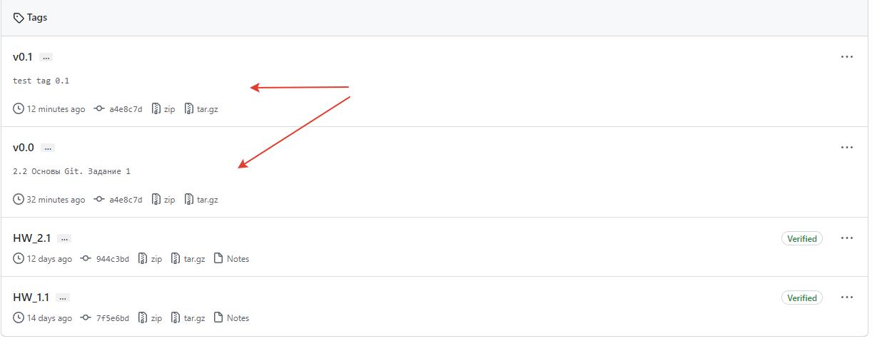
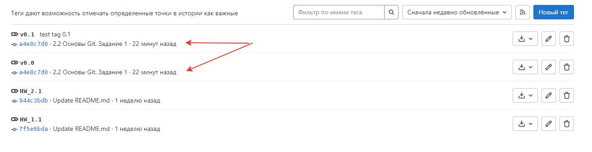
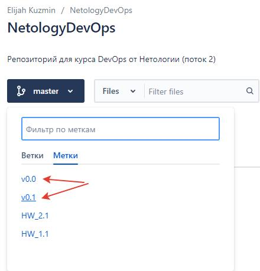
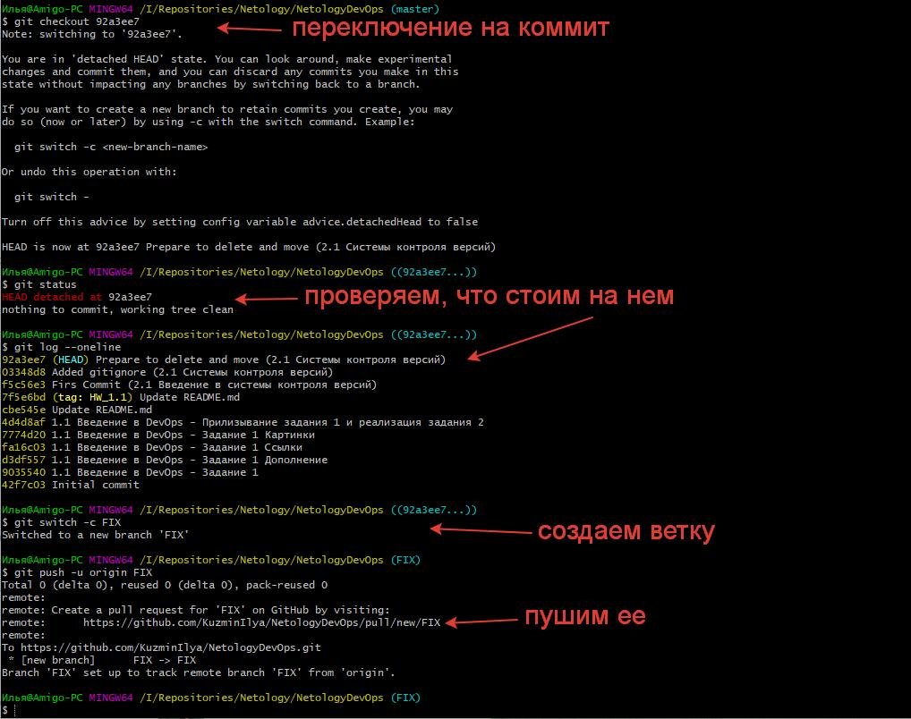
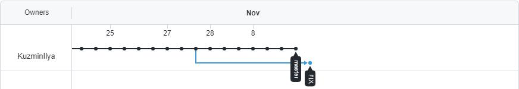
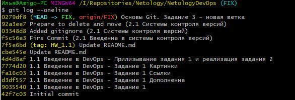

# 2.2. Основы Git, Кузьмин Илья (поток 2)

## Задание 1. Знакомимся с gitlab и bitbucket

**[Github](https://github.com/KuzminIlya/NetologyDevOps)**

**[Gitlab](https://gitlab.com/k1240/netologydevops)** 

**[Bitbucket](https://bitbucket.org/amigo920/netologydevops/src)**

1. Изначальный вывод команды git remote -v

2. Вывод команды git remote -v после добавления gitlab и bitbucket

3. Репозитории:

* **github**

* **gitlab**

* **bitbucket**

## Задание 2. Теги

1. Разница между аннотированным и легковестным

2. Теги в удаленных репозиториях:

## Задание 3. Ветки

1. Создание ветки Fix

2. Коммитим изменения Readme в новую ветку

**Граф репозитория после пуша**

**Вывод git log**

## Задание 4. Упрощаем себе жизнь