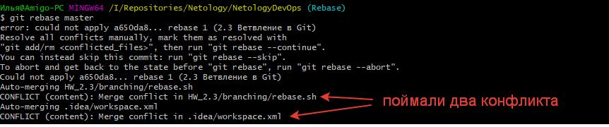
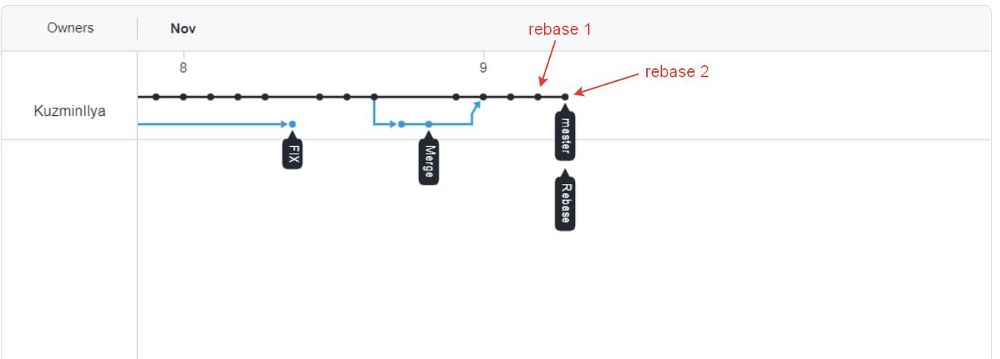

# 2.3. Ветвления в Git, Кузьмин Илья (поток 2)

## Задание 1. Ветвление, merge и rebase.

1. Подготовка - создаем файлы merge.sh и rebase.sh

* **Начальное состояние репозитория**

* **После подготовительного коммита**

2. Подготовка merge.sh

* **Создаем ветку Merge**

* **Заливаем в нее изменения соотв. файла**

* **Граф после добавление ветки Merge**

3. Изменения в ветке master

* **Меняем файл Rebase.sh**

* **Граф после коммита в master**

4. Подготовка rebase.sh

* **Создаем из master ветку Rebase и меняем в ней файл Rebase.sh**

* **Граф после коммитов в Rebase**

5. Merge

* **Мержим ветку Merge в Master**

* **Граф после мержа**

P.S. В системном файле были изменения (забыл добавить в .gitignore ранее, поэтому мерж прошел с конфликтом в этом файле)

6. Rebase

* **Переключаемся на ветку Rebase**

* **Вызываем git rebase**

* **Решаем конфликт**

* **Завершаем rebase**

* **Пытаемся запушить без force**

* **Пушим с атрибутом -f**

* **Мержим rebase и master**

* **Итоговый граф репозитория**

* P.S.S. Во время rebase некорректно изменил файл rebase.sh при ребэйзе, поэтому не получил второго конфликта. Однако на итоговом результате это не сказалось.

