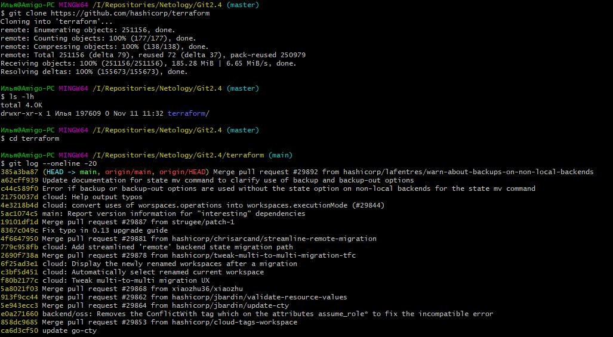

# 2.4. Инструменты Git, Кузьмин Илья (поток 2)

**Склонированный репозиторий**

1. Полученный полный хэш - aefead2207ef7e2aa5dc81a34aedf0cad4c32545. Получено с пом. команды
git show. Поиск можно проводить даже по четырем первым символам - тогда в подсказке будут выданы
разные совпадающие варианты.

2. На коммите стоит тег - v0.12.23. Об этом можно узнать с пом. того же git show 85024d3 с подробной инфой о коммите
или вывести краткую инфу по команде git log 85024d3 --oneline -1

3. У заданного коммита два родителя: 56cd7859e05c36c06b56d013b55a252d0bb7e158 и 9ea88f22fc6269854151c571162c5bcf958bee2b
Сперва была выполнена команда git log b8d720 --oneline --graph, чтобы увидеть дерево коммитов

Затем с пом. команд git show b8d720^ и git show b8d720^2 мы посмотрели описание коммитов-родителей

Еще, т.к. наш у нас мерж коммит, это можно увидеть, если выполнить просто команду git show b8d720

4. Список хэшэй и сообщений, полученных с пом. команды git log --oneline v0.12.23^..v0.12.24

5. Хэш коммита с добавлением функции - 8c928e835.
Узнаем в каком коммите добавлена функция git log -S "func providerSource(" --oneline

Убеждаемся в том, что функция была добавлена git show 8c928e835

6. Находим файл, где определяется функция с пом. команды git grep "globalPluginDirs"

Теперь получаем коммиты, где эта функция изменялась в данном файле с пом. команды 
git log -s --oneline -L :globalPluginDirs:plugins.go

7. Находим коммиты с изменениями этой функции git log --oneline -S "synchronizedWriters"

Смотрим инфу по коммиту, где была добавлена функция git show 5ac311e2a

